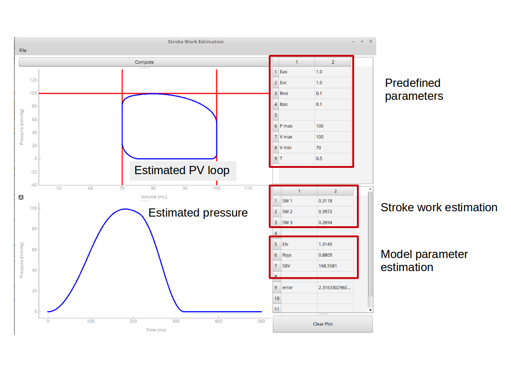
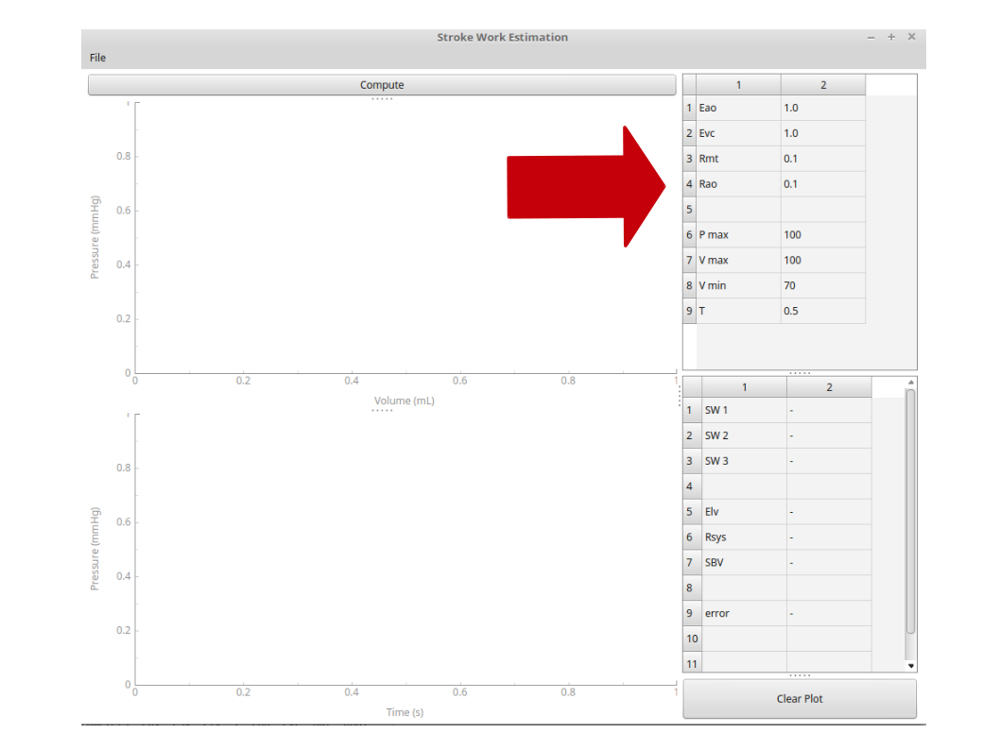
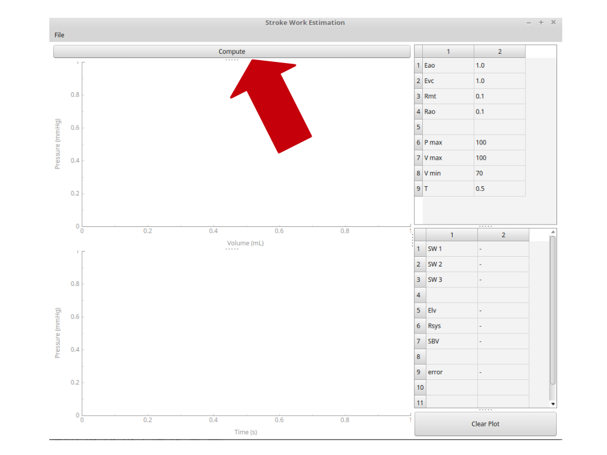
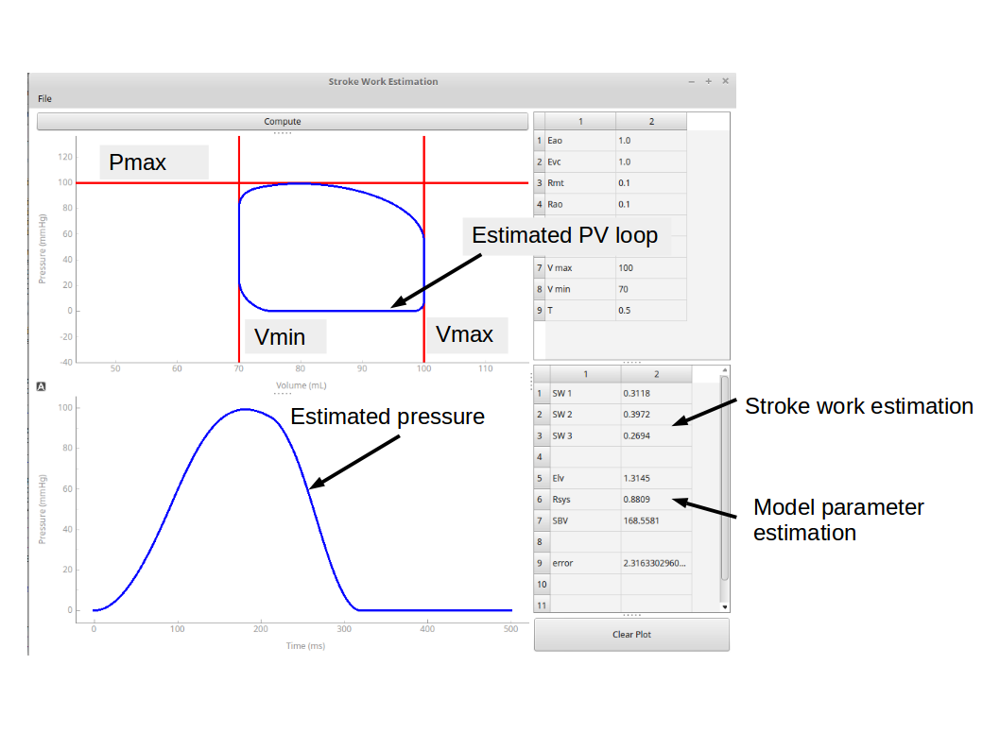

# Stroke work estimation
This repository contains code of a program to estimate the left ventricular stroke work. The method is based on a lumped parameter model.
User have to predefine the maximal pressure (Pmax), maximal volume (Vmax) and minimal volume (Vmin) during the heart cycle.
Also, the model parameters Eao, Evc, Rao, Rvc, and T have to be specified. The program can compute the PV Loop and stroke work based on these settings.
Following figure shows the graphical user interface with an example result.



## Getting Started
These instructions will explain how to install and use the program.

### Prerequisites
This program was developed for Python 3.5. Following packages have to be installed before:
- numpy (1.17.3)
- matplotlib (3.0.3)
- pyqtgraph (0.10.0)
- guidata (1.7.6)
- PyQt4 (4.11.4)
- scipy (1.4.1)

## Run the program
Run following command in your terminal:
```
python SW_estimation.py
```

### 1. Predefine parameters

Eao, Evc, Rao, Rvc, and T are model parameters that can be defined by the user. Standard values serve as default which we found through empirical experiments.

Pmax, Vmax, and Vmin have to be defined by the user in advance. They define the boundaries of the PV loop.

### 2. Compute the stroke work
After clicking on the "Compute" button, the program runs an optimization process in the background that can take up to a minute.


After finishing, the PV loop is plotted and other computation results are shown in the bottom half of the window.
The red lines graphically represent the boundaries (Pmax, Vmax, and Vmin) of the PV loop.



## Methods
The method is based on a lumped parameter model that was developed by Pironet et al. (see references). The model is fitted to the predefined parameters Pmax, Vmax, and Vmin.

## References
- [Pironet, Antoine, et al. "Parameter identification methods in a model of the cardiovascular system." IFAC-PapersOnLine 48.20 (2015): 366-371.](https://www.sciencedirect.com/science/article/pii/S2405896315020583)
- [Pironet, Antoine, et al. "Practical identifiability analysis of a minimal cardiovascular system model." Computer methods and programs in biomedicine (2017).](https://europepmc.org/article/med/28153466)
- [de Bournonville, Sébastien, et al. "Parameter estimation in a minimal model of cardio-pulmonary interactions." Mathematical biosciences 313 (2019): 81-94.](https://www.sciencedirect.com/science/article/abs/pii/S0025556418304802)


## License
This project is licensed under the
GNU General Public License v3.0 - see the [LICENSE](LICENSE) file for details


## Acknowledgments
This study was supported by Fördergemeinschaft Deutsche Kinderherzzentren e.V.
